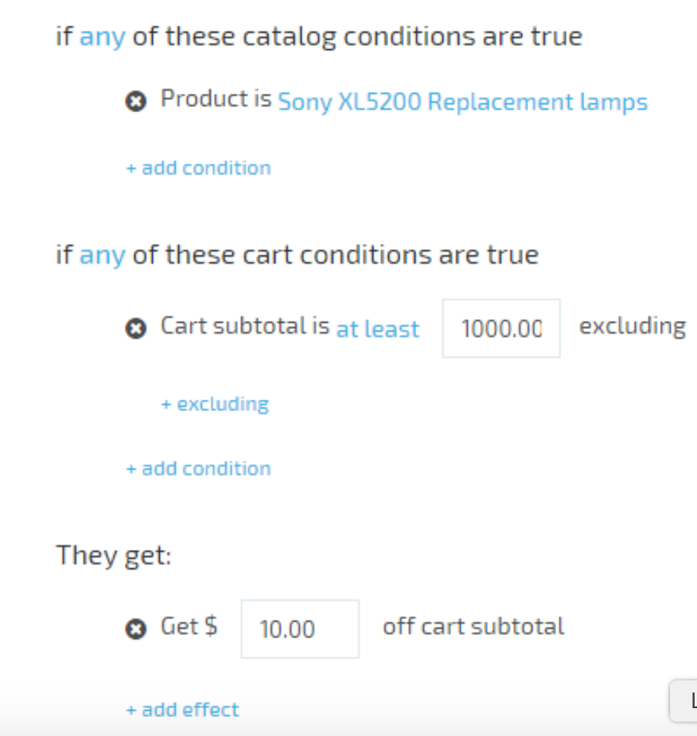
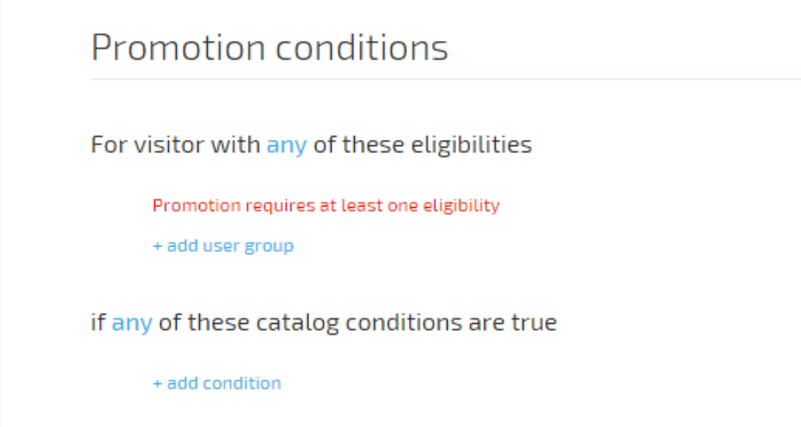

# Add Dynamic Expression To Promotions

A promotion is a marketing tool used to increase sales. Promotions are store-specific; to create a promotion for a store, you must have the Manage Promotions permission. Promotions cannot be shared across multiple stores.

## Promotion Rules

Promotion rules define the behavior and effects of promotions. There are two types of promotion rules:

1. Conditions;
1. Effects.

There are two condition groups:

1. Catalog conditions;
1. Cart conditions.

## Conditions

### Catalog promotion conditions

Catalog promotion conditions are used to make specific products and categories of products more attractive to shoppers through incentives, such as lowered pricing on a particular brand. A catalog promotion condition grants all shoppers a discount on a specific product or set of products. Promotion with matching catalog conditions are always visible to shoppers, so the price they see while browsing the site is the price they pay at checkout time (except taxes and any promotions with matching shopping cart conditions that may apply).

### Cart promotion conditions

Cart promotion conditions are used to encourage shoppers to increase their order size by providing incentives, such as free shipping on orders over a certain sum. A shopping cart promotion conditions grants a discount on a specific product or set of products to shoppers who meet them. Cart promotions are only applied after the promotion conditions expression returned true. Thus, a shopper only sees the price that will be paid for a promoted item when it's viewed in the shopping cart or during checkout (assuming all the promotion's conditions are met).

## Effects

Effects specify what benefits are granted by a promotion. They are the incentives used to encourage customers to purchase more or to purchase specific items. Examples of effects are:

free shipping
discounts on specific products
free items
coupons for discounts on future purchases.

## Expression Builder

The visitor block is similar to promotion rules. It specifies criteria that determine, based on information that has been collected about the visitor, whether that visitor is eligible to receive a promotion.

There are three options:

Everyone - no filtering
*Register user - *user that is currently logged in to storefront
First time buyer - registered user who has never made any purchase

**Important** The user who has just created an account is always the first time buyer.

