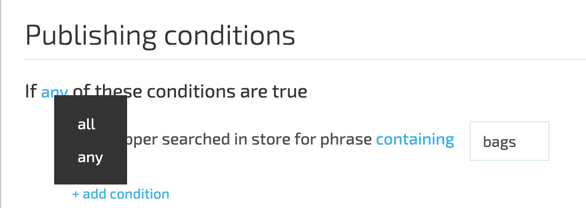

# Add Dynamic Expressions to Dynamic Content

## Expression Builder

Expression builder is used to create a human readable conditions set under which the Dynamic Content should be displayed.

Expression builder consists of two main parts. The first is the global operator for the whole conditions set. It sets if the expression returns true if any of the conditions satisfied or if all of the conditions are satisfied. The behavior is set using all/any operand.

The second part is the conditions collection. Available conditions are grouped into four groups:

1. Browse behavior;
1. Customer Profile;
1. Geo Location;
1. Shopping Cart.

Names of the conditions under those groups are self-explanatory. Values of the conditions can be of two types string and decimal.

**Operators for string value conditions can be:**

1. Matching (means the value of the context appropriate Tag should match the entered value);
1. Contains (means the value of the context appropriate Tag should contain the entered value. The comparison is case-invariant);
1. Not matching (means the value of the context appropriate Tag should not match the entered value);
1. Not contains (means the value of the appropriate context Tag should not contain the entered value. The comparison is case-invariant).

**Operators for decimal value conditions can be:**

1. Greater than (means the value of the appropriate context Tag should be greater than the entered value);
1. Greater than or equals (means the value of the appropriate context Tag should be greater than or equals the entered value);
1. Less than (means the value of the appropriate context Tag should be less than the entered value);
1. Less than or equals (means the value of the appropriate context Tag should be less than or equals the entered value);
1. Matching (means the value of the appropriate context Tag should match the entered value).
