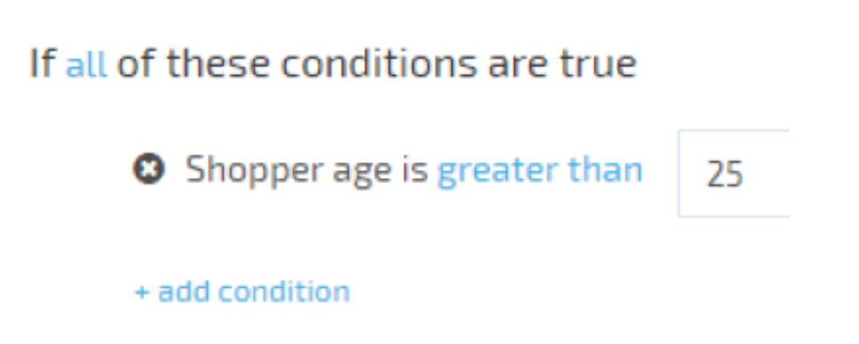

# Compose Dynamic Conditions

Sometimes there is a need to give an end-user a way of composing conditions under which target objects should be filtered and returned to the client. For example, "the product should be available to the shopper only if he is more than 25 years old". Simplifying condition expressions building for the end-user is often a challenge.

The most common way to build condition expressions is by using a visual UI. That way the user builds the condition expression as a regular sentence. While reading a regular sentence it is easy to understand the specific circumstances the result will yield: object returned. In VirtoCommerce, we decided to implement this approach. Based on our experience gained developing 1.x version of VirtoCommerce that is implemented using WPF we decided to migrate conditions composing functionality from there. .NET Expressions fits well to filter objects and save the filter as they are serializable. For showing conditions to a user we used AngularJS as the platform uses it. So, our solution is to compose conditions using lambda expression tree and angularjs, to show the conditions to the end-user.

Example: "Show banner if all of the conditions are true: shopper age is greater than 25"

## Solution Review

1. It must have a method that returns the lambda expression which returns a boolean value based on the provided context parameter. That way it's possible to get linq expression of the condition to evaluate it later.
1. It must provide properties to show and edit configurable condition parameters. That way we give the end-user a way enter condition values for comparing with the context passed values.
1. It must have array property of current children conditions. If the condition can have nested conditions they will be saved here.
1. It must have array property of possible children conditions. If the condition can have nested children we should give an end-user a way to add them from the array of available nested conditions. Those conditions are saved here.
1. The condition class must be serializable/deserializable. In order to save and restore the conditions tree there is a need to serialize/deserialize the condition.
1. Condition can be showed/edited using AngularJS. The end-user should be able to view and edit the conditions.

For more details about each point please review the Developer Documentation  - https://virtocommerce.com/docs/vc2devguide/working-with-platform-manager/extending-functionality/composing-dynamic-conditions

